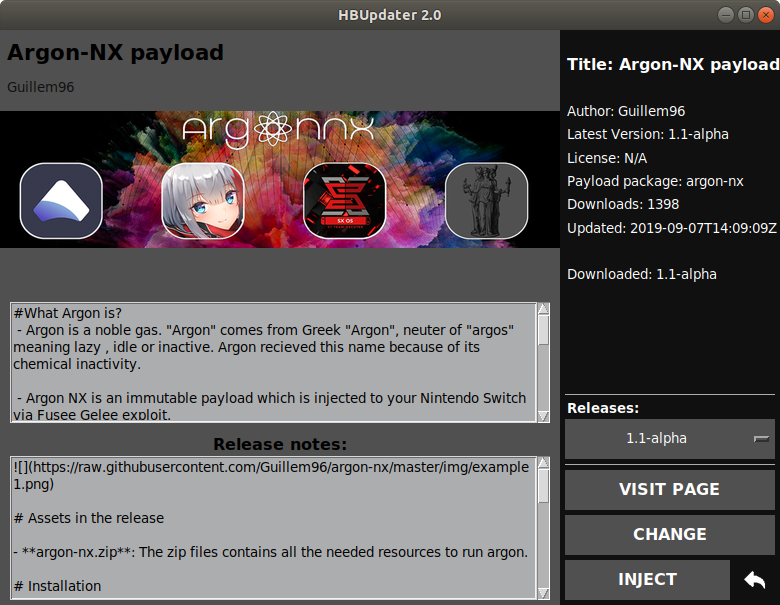

# HBUpdater


 []() []()

# About
HBUpdater is a one-stop-shop for managing and updating your Nintendo Switch Homebrew.

# Notes
  - Downloads packages directly from github
  - Easily install lots of popular Homebrew
  - RCM injector (payloads downloaded from github)
  - Tracks which homebrew and what versions you have installed, compatible with the Homebrew Appstore 
  - Content includes tools, emulators, media viewers, games, and more
  - No longer visit 17.53 different places to make sure you have the latest version of everything

## View update notes and install old/legacy versions


## Built-in RCM injector


# Requirements:
    Works on: Mac, Window, Linux
    Python 3.6 or greater

# How to use:
##### Windows:
  - Extract HBUpdater.zip
  - Install [python](https://www.python.org/downloads/release/python-373/)
    - If you do a custom installation remember to install tcl/tk, add python to the path, and include pip
  - In a command prompt type ```pip install pillow pyusb``` to install dependencies
  - Double-click startHBUpdater.bat

##### Macintosh:
- Extract HBUpdater.zip
- Mac users may already have a compatible version of python installed, try double-clicking HBUpdater.py
--If the file opens in a text reader, close the reader and right-click the file and open it with pylauncher
- If this still doesn't work, install [python](https://www.python.org/downloads/release/python-373/)

##### Linux:
- Extract HBUpdater.zip
- Navigate to the directory in a terminal
- Type "python HBUpdaterGUI.py"
  - If you are missing dependencies do the following:
  - sudo apt-get install python3 python3-pip python3-tk python3-pil.imagetk
- If you don't know how to do this you should probably be using Windows.
- For access to USB functions you must run python with elevated privledges (sudo)

## TroubleShooting:
##### Mac:
- Error:
  - ```ssl.SSLCertVerificationError: [SSL: CERTIFICATE_VERIFY_FAILED] certificate verify failed: unable to get local issuer certificate (_ssl.c:1056)```
- Solution:
  - Macintosh HD > Applications > Python3.6 folder (or whatever version of python you're using) > double click on "Install Certificates.command" file

# How it works:

## The big picture
[**repo collection**](#repo-collection)

[**repo stitiching**](#repo-stitching)

[**repo distribution**](#repo-distribution)
  
[**repo parsing**](#repo-parsing)
  
[**package management**](#package-management)

## repo collection
    Package entries are created from several lists of structs, each struct in the form:
    ```json
    template = {
      "name" : None, #Project Name
      "store_equivalent" : None, #Homebrew appstore package for compatibility, if it exists, otherwise it's an HBUpdater specific package
      "githubapi" : None, #Api url to access an etagged json from
      "author" : None, #Github author, multiples separated by comma
      "projectpage": None, #Usually github or a scene site
      "description" : None, #Usually pulled from github or a scene site
      "group" : None, #One another sorting field
      "install_subfolder": None, #Subfolder to unzip to or place file in
      "pattern" : [[],], #Pattern of the target asset (payload, zip, binary, etc)
      "license" : None, 
      "tags" : [] #list of items for future sorting
    }
    ```
    Each list represents a category and is added to the json as a key-value pair `{category : category_repo_entries_list}`.
    This struct is contained in a list object in a [repos.py file](https://github.com/LyfeOnEdge/HBUpdater_API/blob/master/repos.py). the python file was chosen over a hand-made json file to ensure conformity by assigning things such as groups, tags, and license types to global strings, before it gets turned into a json object.

## repo stitching
    The repo builder is the repomaker_server.py script located in the source of LyfeOnEdge/HBUpdater_API. It accesses the github api using a github token. The purpose of the token is twofold, it allows the repo builder to exceed the normal 60 api requests / hour as well as make releases in its *own* repo. This means the "releases" section of the LyfeOnEdge/HBUpdater_API repo source on github acts as an etagged "server" for the repo json.

    The repo builder goes through each entry in the repo and grabs the api json, it then adds the loaded api json as a value to the entry.

## repo distribution
    When each entry has had an updated json object appended the whole object is organized into a json object and dumped. If any content in the json has changed it gets pushed as a new release to github, with the tag name incrementing by one.

    The receiving app (LyfeOnEdge/HBUpdaterGUI) grabs the repo file by getting the github api releases json at https://api.github.com/repos/LyfeOnEdge/HBUpdater_API/releases, which contains a link to the latest release of the HBUpdater_API repo.

## repo parsing
    The receiving app (LyfeOnEdge/HBUpdaterGUI) parses the json into dict-mapped lists, with parser.all containing all categories except those that have been specified as blacklisted. Each category is displayed on a page in the app.

## package management
    HBUpdater uses a heavily modified python rewrite of vgmoose's [libget](https://github.com/vgmoose/libget)
    It should be compatible with vgmooses [Homebrew Appstore](https://github.com/vgmoose/hb-appstore), except packages not also offered by the appstore will not show up in vgmoose's appstore.

##### Want to contribute? Have ideas? Questions? Great!
You can find me here: 
**[4TU/Switchbru](https://discord.gg/uAfu6yM)**